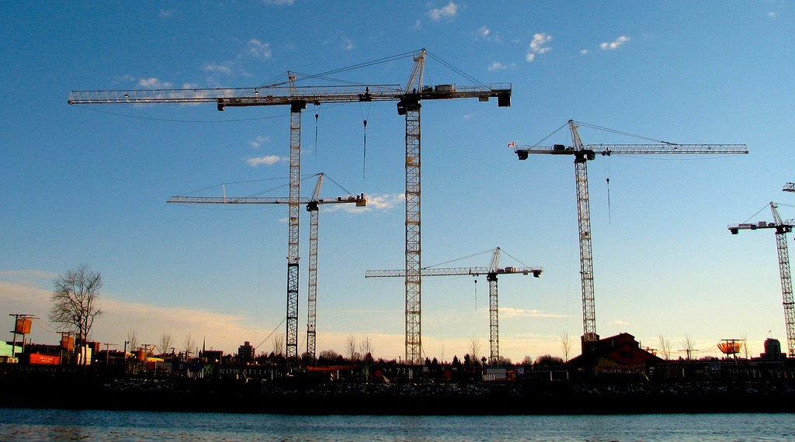

published:: [[Aug 6th, 2014]]
type:: blog
tags:: #community, #Vancouver, #Startup, #[[Brad Feld]]
header-image:: 
wayback:: https://web.archive.org/web/20140811044539/https://blog.bmannconsulting.com/30-more-years

- I've been in an introspective mood lately. It's 2014, 10 year since I returned to Vancouver. 10 years of working with web technology and community building. What has changed about Vancouver, and where is it heading? How long does it take to level up a startup ecosystem?
- I was recently at a talk at [Hot Art Wet City](http://hotartwetcity.com/), where [Chris Tyrell Loranger spoke](http://hotartwetcity.com/hottalks-christyrell/). Chris has been part of Vancouver's arts community for many years, and has been a part of and helped build associations, art galleries, and shared spaces.
  
  In fact, Chris stated that he's been working as a visual artist locally since 1976.
  
  That happens to be the year _after_ I was born, so it really got me thinking. I've been an entrepreneur, a community member, and an investor here in Vancouver for 10 years. So what?
  
  It takes time to build and level up local communities. It takes a long time. We forget this, because the technology industry we are all involved with seems to move so quickly.
  
  I remember [[Roland Tanglao]] and  [[Avi Bryant]] organizing a [geek dinner way back in February 2004]([[Vancouver Geek Dinner Wrap-up]]) at Hon's on Robson[^1]. I think something like 7 or 8 people attended. Flickr was just going into more public beta testing, and Roland had beta access codes for everyone. I was connected both to people locally, as well as to online community technology that was being _built_ here, but was part of a worldwide community.
  
  Let's pause and think about how far we've come. Any night of the week you can check out a variety of [events & meetups]([[WeAreYVR]]), usually with 5 to 20 times as many people as that little geek dinner meetup.
  
  But we've got more to do.
  
  Reflecting again on what Chris had to say about the arts community, it struck me that art has been around for a while. There are national, provincial, and local associations for a variety of disciplines - the Canada Council for the Arts, the BC Craft Council, or the Eastside Culture Crawl. Oh sure, there are arguments about art vs. craft, and the painters are in one corner and the potters in another, but these practices have actually been around long enough to have some history and accumulated learnings.
  
  In tech, we can hardly come up with a working definition for web designer, decide whether programming is best suited for apprenticeship training vs. a university degree, or figure out what skills a front-end developer should have.
  
  In that view, 10 years is not a lot of time. Heck, [Amazon's AWS cloud servers only launched in 2006](http://en.wikipedia.org/wiki/Amazon_Web_Services), which has triggered a whole host of new developments and practices that continue to evolve.
  
  [[Brad Feld]] has literally [written the book on Startup Communities](http://www.startuprev.com/books-communities/). I remember meeting him in person the first time 5 years ago, when he visited Vancouver[^2], and him telling us that it takes a long time – as in decades. On good days, I wake up thinking that we've moved Vancouver quite far along the path of a sustainable tech ecosystem. On bad days, I think we've still got decades more to go.
  
  Brad was interviewed in the MIT Technology Review for an article that was titled [It’s Up to You, Entrepreneurs](http://www.technologyreview.com/news/516521/its-up-to-you-entrepreneurs/), and had this to say in response to what the 'most important step an entrepreneur can take to create a startup community':
  
  > The goal is start finding the other entrepreneurial leaders who are committed to being in your city over the next 20 years. Then, as a group, get very focused on knowing each other, working together, being inclusive of anyone else who wants to engage, doing things that help recruit people to that geography, and doing selfish stuff for your company that also drives your startup community.
  > [[Brad Feld]] http://www.technologyreview.com/news/516521/its-up-to-you-entrepreneurs/
  
  The entire article is great, and has more directives in it – like the fact that entrepreneurs _should_ be thinking along 20 year time frames and commitments to the place they live in.
  
  I'm committed to being in Vancouver, I figure I've got at least 30 more years in me if that's how long it takes, and I look forward to making it the best community we can. 
  
  [^1]: I even found the [Upcoming.org event on the Wayback machine](http://web.archive.org/web/20050311064029/http://upcoming.org:80/event/3116/)
  
  [^2]: I actually did find the Upcoming event for Brad's talk on Wayback as well, but [Brad's wrap up post](http://www.feld.com/archives/2009/04/vancouver-entrepreneurial-energy.html), the [Eventbrite page that shows attendees](https://www.eventbrite.ca/e/beers-with-brad-feld-yvr-tickets-312858769), and [Parveen Kaler's write up](http://parveenkaler.com/posts/beers-with-brad-feld-in-vancouver/) are much better links to share. And that was only 5 years ago!