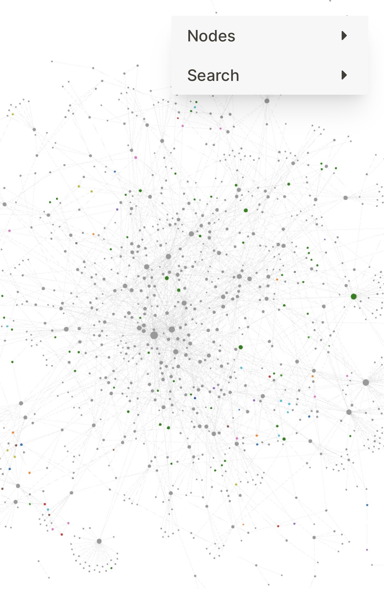

- Flipped over to [[Github/Pages]] for testing publishing
	- Available at https://logseq.bmannconsulting.com
	- Key point: need to go into LogSeq (three dots top right) → Settings → Editor, and toggle "All pages public when publishing"
	- LATER Figure out what the tagging custom is for public vs private pages to potentially combine my notes
	- LATER Figure out #LogSeq custom commands or some other way to get unicode arrows → from `->`
- Posting about this new-but-temporary site
	- Can I post an image from mobile?
	- 
	- Mobile #screenshot of my #LogSeq graph for this site
- Alex MacCaw
	- This is one of the coolest GitHub projects nobody has heard of. Created by @ccorcos (who built Notion).
	- [[Tuple Database]]
	- https://twitter.com/maccaw/status/1603944739275149312
	-