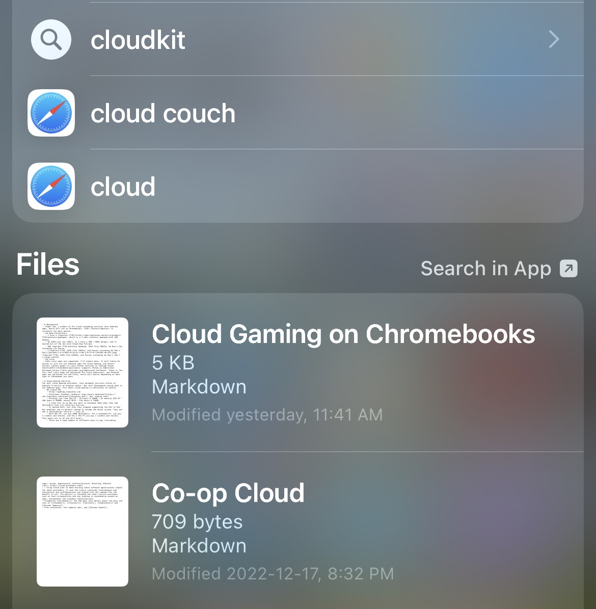

- [[Web app manifests]]
- New to me feature of having #LogSeq notes as files on iOS — Spotlight indexes them!
	- If you do a regular search, the Files section of results will show matching content
	- Here’s an example search for “cloud”
	- 
	- Clicking on them brings up the Markdown plain text file
	- Apps can use the [Spotlight API](https://developer.apple.com/documentation/foundation/spotlight) to customize this directly in their app (and it would be useful for LogSeq to do this), but “just” having files on disk be part of the index automatically is pretty great — [[integration through the file system]] in action
- I wrote about [[Indie Kit]] yesterday and it turns out creator [[Paul Robert Lloyd]] is formally launching it: [Introducing Indiekit: The IndieWeb for Everyone](https://paulrobertlloyd.com/articles/2022/12/indiekit/)
	- Seen via [[Robin Rendle]] [IndieKit](https://www.robinrendle.com/notes/indiekit/)
	- This is still very much a run your own server sort of deal
	- What would a serverless version of this look like?
	- And yes, we should do a Fission Web3Storage UCAN endpoint to put media on IPFS
- [[Stock and Flow]] is a piece that [[Robin Sloan]] wrote on Snarkmarket many years ago
	- ((d06815f1-2aaa-4ce7-88f4-168e6c114ad7))
	- ((63a141c2-6079-4c72-ad03-76bb5c751ab0))
	- Seen via [@eliotpeper](https://twitter.com/eliotpeper/status/1605064474565562368)
	- I’m getting good personal flow with daily Journals, like this typing here
	- Little tidbits and fragments of orphaned page notes don’t quite add up to anything, so my stock builds slowly
- [Valve is paying a whole lot of developers to keep the Steam Deck's open-source software going](https://www.pcgamer.com/valve-is-paying-a-whole-lot-of-developers-to-keep-the-steam-decks-open-source-software-going/) #opensource #[[Steam/Deck]]
	- > in a recent chat with the [Verge](https://www.theverge.com/23499215/valve-steam-deck-interview-late-2022), Steam Deck designer Pierre-Loup Griffais mentioned that the company is paying over a hundred open-source devs to work on the various bits of software that keep the Steam Deck ticking. Valve has them working on stuff like Steam for ChromeOS and Linux, too
	- > Griffais said Valve's corralling of open-source devs is part of "a larger strategy to coordinate all these projects and set up kind of an overall architecture" for gaming on Linux. That is to say, Valve is using its technical and financial clout to herd the cats of open-source development in a single direction, in order to get Linux functioning as a viable alternative to Windows for PC gaming.
- Yes, I have a [[Steam/Deck]]! It’s been _great_
	- There’s a great [[Steam Deck Guide]] made with #TiddlyWiki
	-