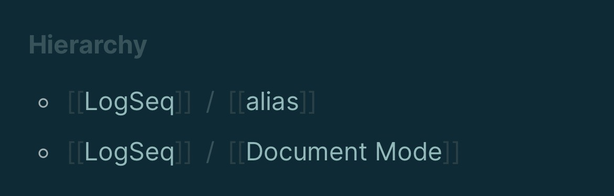

- [Mastodon Brought a Protocol to a Product Fight](https://500ish.com/mastodon-brought-a-protocol-to-a-product-fight-ba9fda767c6a) by [[M. G. Siegler]] #Mastodon #protocol
  collapsed:: true
	- Yes it’s a great title and line
	- He seems to be expecting a Twitter competitor to go toe to toe with, and doesn’t believe in protocols
	- Mastodon and mastodon.social not being better integrated or run at scale is a problem of that project — a product issue, for sure
	- This should mostly be seen as the starting gun of an opportunity for many different people to experiment with social network products on top of the #ActivityPub protocol
	- Is RSS - in blogging form or podcast form? - the correct counter example of a protocol that enables lots of different high quality product experiences?
- [How I use Mastodon](https://taoofmac.com/space/blog/2022/12/28/1550) by [[Tao of Mac]]
  collapsed:: true
	- Using [[Moa Party]] — gotta see if maybe he can help package for [[piku]] or Docker
	- Using [[MetaText]]
	- Has a massive feature list for an iOS client
	- On #ActivityPub:
		- > It is, sadly, a child of the W3C era, and thus relies entirely too much on lobbing chunks of JSON to and fro via HTTP to various endpoints you discover along the way instead of (say) using persistent connections, binary payloads and a topic structure (but I’m biased here).
		- > The most promising alternative server for me is [[Takahē]], which I’ve [already written about](https://taoofmac.com/space/blog/2022/12/21/0900) and intend to contribute to. Its core design avoids most of the problems with scaling ActivityPub], it has a solid foundation and (although it depends too much on PostgreSQL) it feels like the logical choice for easy to maintain, small-to-mid instances.
		- Points at [[Pleroma]] fork [[Rebased]] for solid server to run
		- [[Soapbox]] as a separate front end
			- Announcement of [Soapbox 3.0 Release](https://soapbox.pub/2022/12/25/releasing-soapbox-3-0/) has lots of details
			-
- Discovered [[LogSeq/Hierarchy]] today
	- Actually pretty convenient to group things around a category instead of having a ton of “NAME foo” and “NAME bar” pages
	- Was initially thinking that maybe Archive or Blog might be useful too, but I don’t like the way this changes the title
	- #screenshot of what the default display is for Hierarchy
	- 
- [[Paul Frazee]] posted [an archive notice](https://github.com/beakerbrowser/beaker/blob/master/archive-notice.md) to the [[Beaker Browser]] repo that also is a great post mortem for him and his projects
  collapsed:: true
	- via [[Jacky Zhao]] in [Noosphere Discord](https://discord.com/channels/1003419732516552724/1006037244815089715/1057751973157417042)
	- From [[Secure Scuttlebutt]] to Beaker to “solve” distribution of apps
	- Issues:
		- nothing for #mobile
		- #[[Dat Protocol]] #Hypercore sites didn’t work in regular browsers
		- Couldn’t sync state between multiple devices
	- > I always knew were were trying to steer the Web as outsiders, but what I didn't expect was how fundamentally hard it is to tweak how the Web works.
	- Then briefly CTZN, a social network
	- > The entrepreneurs reading this may recognize a common failure pattern here: we got to a really great demo fast, and then hit a cliff that we couldn't surmount. Rather than taking the L and re-evaluating, I slammed my head into the cliff hoping I could break through via force of will, but the tech just wasn't there, and the product wasn't either.
	- > As decentralizers we may be pursuing a mission, but our work only wins in the market, and to win in the market we need to think like entrepreneurs. Ultimately, my lesson learned is that mission needs PMF.
	- > Don't get too precious about the Web. It's a wonderful open platform, but it's settled into its purpose. Look for opportunities to create new open platforms that fit the moment.
	-
- [Don’t let federation make the experience suck](https://benlog.com/2022/12/28/dont-let-federation-make-the-experience-suck/) by [[Ben Adida]] #Mastodon #Fediverse
- [[Tiago Forte]] #secondbrain #mobile
	- {{tweet https://twitter.com/fortelabs/status/1608311993303445505}}
	- In the replies, many users of [[Professional Desktop Operating Systems]] can’t believe that mobile is the future
	- Can’t believe that their own usage patterns don’t translate to everyone else
	- The “younger people are more comfortable on mobile” is overshadowed by most of the world only having a mobile computing device, and zero usage of [[Professional Desktop Operating Systems]]
-