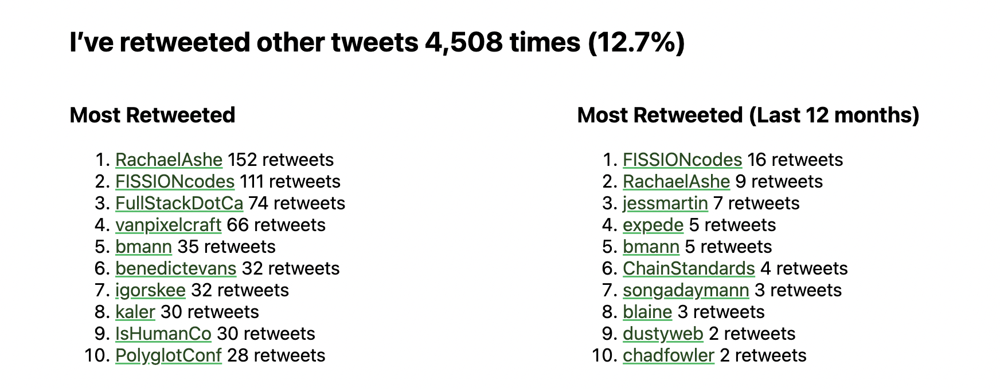
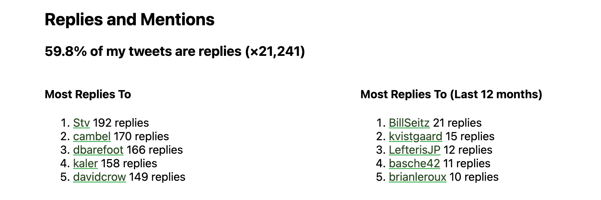
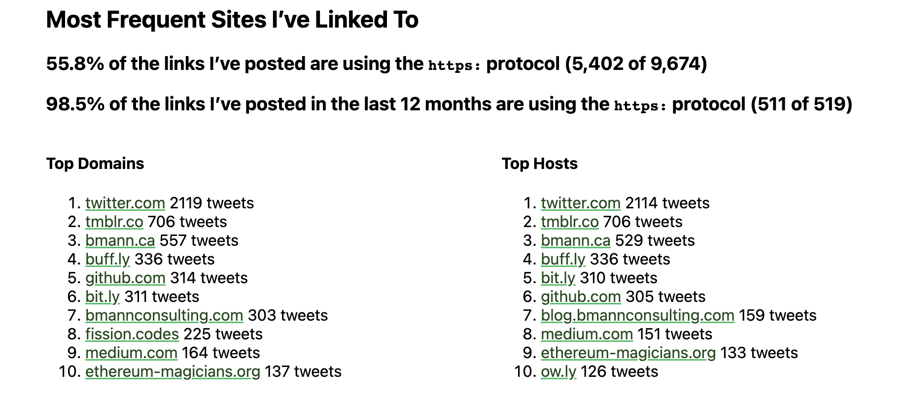
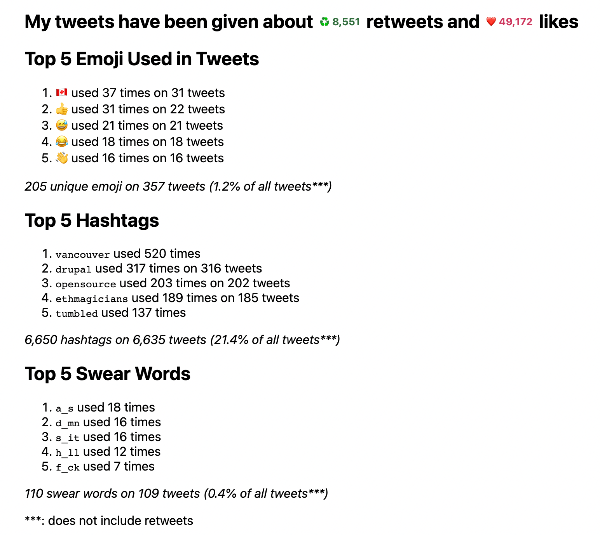
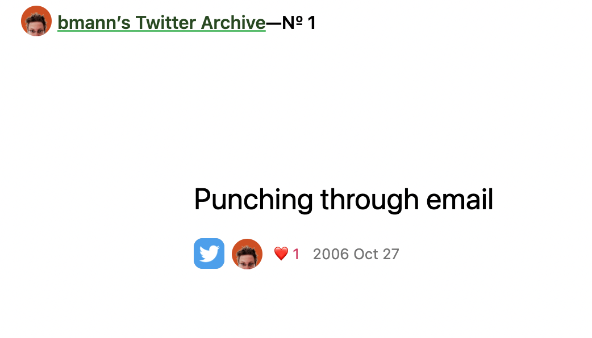

- Happy New Year, from UTC-8 in #vancouver
	- I'm up after midnight because I [flipped the switch on this site](((63b12e49-013d-46b1-ab1c-a6ac7208ef1a)))
	- Check the #FoodWiki for [details on a nice scallop dinner](https://foodwiki.bmann.ca/December%252031st%252C%25202022.html)
- [I am not a supplier](https://www.softwaremaxims.com/blog/not-a-supplier) Thomas Depierre #opensource #[[commons funding]] #[[software supply chain]]
	- > Until then, I am not your supplier. So all your Software Supply Chain ideas? You are not buying from a supplier, you are a raccoon digging through dumpsters for free code. So I would advise you to put these rules in the same dumpster. And remember. I am not a supplier. Because `THIS SOFTWARE IS PROVIDED “AS IS”`
	- #via [JP Mens](https://mastodon.social/@jpmens/109615093397373991)
- Got my [[Twitter Archive]] setup with #Tweetback
  id:: 63b23c86-d6ea-4149-b461-4767c36c2255
  collapsed:: true
	- A few changes from the instructions, but things worked pretty flawlessly
	- I edited the #[[Git/Ignore]] to add the following:
		- ```
		  .DS_Store
		  database/tweet.db
		  database/tweets.js
		  img/*
		  ```
		- My tweets are over 60MB and the database ends up over 50MB -- the #Github limit for individual files is 50MB
		- Those images are cached images, I also don't want to check them into Github
	- When running the import, I get this error around video:
		- `Video request error ENOENT: no such file or directory, open './video/970011759846178816.mp4'`
		- Repeated for every video. I haven't uploaded much raw video to Twitter, so this is fine
		- Also a handful of images with 404
	- In the future, I can update this with `npm run fetch-new-data`
		- I do have a Twitter developer account that has v2 access, so I went in and created a new Bearer Token, and added it to the local `.env` file
		- I ran it to test, and since my Twitter archive is from [[Nov 15th, 2022]], it did grab new tweets
	- Ran it locally, and it spits out a bunch of stats
		- Retweets
		  id:: 63b23c86-9850-453a-ae84-15471f94a2f9
		  
		- Replies (oh god, I guess I'm a Reply Guy!)
		  
		- Sites Linked To
		  
		- RTs, Likes, Emoji, Hashtags, and swear words
		  
		- And, my first tweet!
		  
	- I also setup a #Fission app for it
		- `fission app register --name bmctwitter`
		- That gets me a `fission.yaml` and auto-detects `_site` as the build folder
		- I'll map `twitter.bmannconsulting.com` to it
-