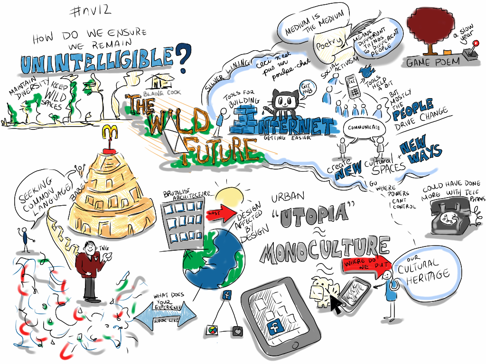

- Reading [[Unlocking the Commons]] #[[commons funding]]
	- ((63b8631b-8c56-439e-80c0-8b4a86d57e92))
- Built a [[Reading List]] page, added it to the Contents sidebar
  collapsed:: true
  id:: 63b925af-6bde-4f4f-8269-9da874cf8f43
	- Figuring out #[[LogSeq/Queries]] a bit, but clearly need to learn #ClojureScript
	- There's an [[On This Day]] script in the [LogSeq Discourse Forum](https://discuss.logseq.com/t/this-time-last-year-query-in-config-edn/8398/3) that I need to figure out how to insert into `config.edn`
	- I figured out my first mistake, was looking more carefully at what are sections / arrays
	- Took a second look, and there is a simple version that does work:
	- ```
	  {                                                                                                    
	      :title            "This time last year"                                                                        
	      :query            [:find (pull ?b [*])                                                              
	                         :in $ ?span                                                                      
	                         :where                                                                           
	                         (between ?b ?span ?span)                                                         
	                         ]                                                                                
	      :inputs           [:365d-before ]                                                                   
	     :collapsed?       false} 
	  ```
	- This only grabs things from exactly a year ago
	-
- Talking to [[Blaine Cook]] about upcoming [[Vancouver DWeb Social]]
	- Remembering he spoke at [[Northern Voice]] in 2012
	- Any record of this online? Yes! His keynote was called [[The Wild Future]] and I've collected some references there
	- The live talk visualization is very cool:
	- 
	- No video! That was expensive back then!
	-