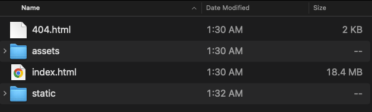

- [[LogSeq/Admonition]] formatting is very cool
	- Type `<` and you get a pop up of lots of things
- LATER Move [[2020-03-31-onthisday-wa-state-roadtrip]] #BMC/Backlog
- That moment when you realize that your #[[LogSeq/Export]] packs everything into a single `index.html` -- just like #TiddlyWiki's single file wikis!
	-  #screenshot
	- 18MB! No wonder it is slow to load!
	- I really don't want to have to build a #Hugo site using [[LogSeq/Schrödinger Plugin]] but it may be the only sane thing to do
	-