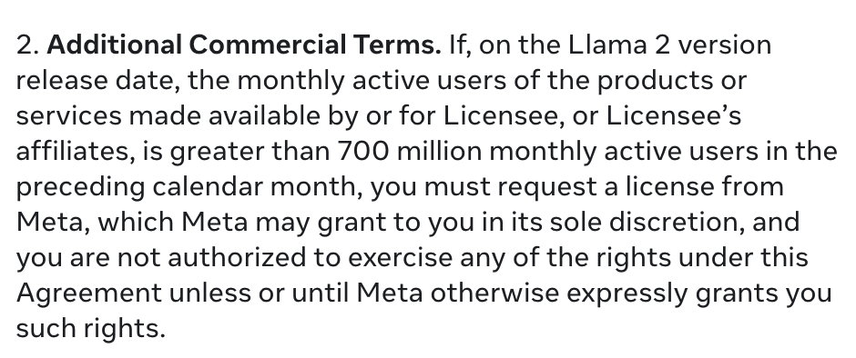

- [[Devon Zuegel]] [[The unconference toolbox]] #unconference
	- ((64b6d9f7-31c8-4e5f-b2d1-cd069da2ea71))
	- #via [[walkah]]
- [[OpenAI]] has new #licensing terms for [[Llama 2]]
	- > The new Llama 2 model has an additional licensing requirement which prevents use if you have >700M MAUs, which is an oddly high number. OpenAI's ChatGPT hit 100 million MAUs in January, and has gone down since.
	  > It's essentially a "Amazon and Google don't use this k thx."
		- 
		- twitterlink:: https://twitter.com/minimaxir/status/1681337241740910594
	- This was #via [[Gordon Brander]] in the [[Subconscious/Discord]]
	- > FB adding riders to “open” source licenses tells me they are consciously engaging in open source to commoditize their compliments
		- discordlink:: https://discord.com/channels/1003419732516552724/1006037244815089715/1130905569457340488
		- [[Joel Spolsky]] [[Strategy Letter V]] aka the commoditize your compliments post
			- ((64b6ca74-003f-4c06-9dac-f0933f004753))
	- Which prompted me to mention the [[Big Time License]]
		- It defines small business usage for which no paid license is required:
		- ((64b6c7f5-9589-461e-8c1d-0fecc3c78d6a))
		-
		-
	-