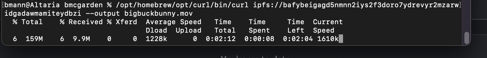
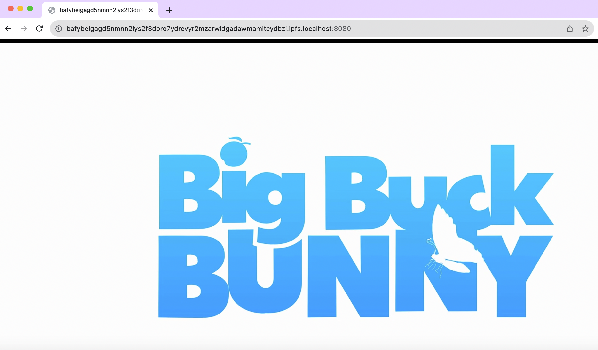
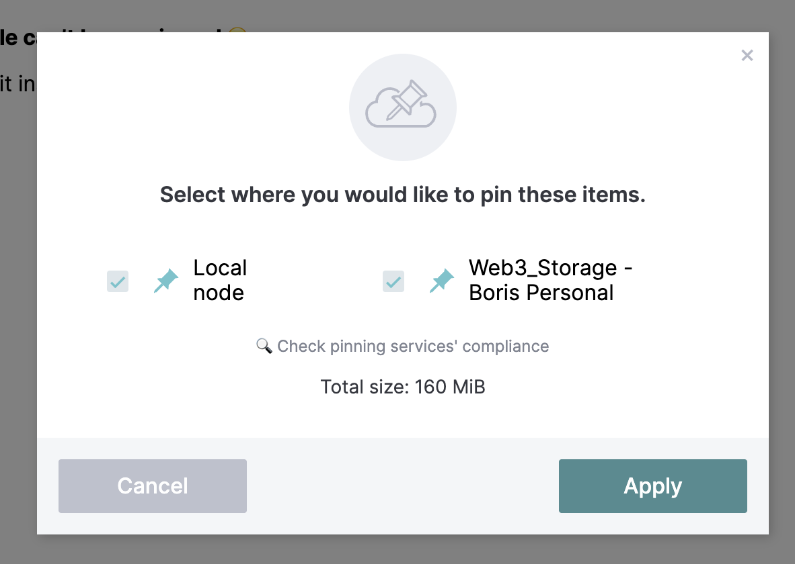

- [[curl]] now has merged in support for the #ipfs protocol, so I wanted to test it
	- The [curl daily snapshots](https://curl.se/snapshots/) only has binary builds for Windows and Arch Linux and I'm on #MacOS, but you can install HEAD using [[Homebrew]]
	- Via [[Mark Gaiser]] who finally landed this patch into curl, here's a one liner:
		- ```shell
		  /opt/homebrew/opt/curl/bin/curl ipfs://bafybeigagd5nmnn2iys2f3doro7ydrevyr2mzarwidgadawmamiteydbzi | ffplay
		  ```
		- That should fetch the [[Big Buck Bunny]] movie encoded as #webm video, using a local IPFS gateway
		- I didn't alias curl over system curl, so that's the full path of where the HEAD version of curl is installed for me using #Homebrew
	- Here's the step by step of what I did
		- I used `brew install curl --HEAD` to get the newest curl, installed at `/opt/homebrew/opt/curl/bin/curl`
		- I used [[IPFS Desktop]] to run a local IPFS node
		- I ran this one liner, which will download the hash representing and output it to a file named `bigbuckbunny.webm` in the directory where you run the command
			- ```shell
			  /opt/homebrew/opt/curl/bin/curl ipfs://bafybeigagd5nmnn2iys2f3doro7ydrevyr2mzarwidgadawmamiteydbzi --output bigbuckbunny.webm
			  ```
			- You'll see a progress bar in your terminal
				- 
			- And if we look, you'll see incoming bandwith to IPFS Desktop
				- 
			- On MacOS, double clicking the file will open and play it in a browser like Chrome which has webm video support
			- You've just tested IPFS support in curl!
		- Exploring Big Buck Bunny with [[IPFS Desktop]]
			- It's also available in your local IPFS node now, so if you paste in the hash into IPFS Desktop `bafybeigagd5nmnn2iys2f3doro7ydrevyr2mzarwidgadawmamiteydbzi` and hit browse, it will prompt you to open it with your local gateway
			- 
			- Your local gateway link is this: http://bafybeigagd5nmnn2iys2f3doro7ydrevyr2mzarwidgadawmamiteydbzi.ipfs.localhost:8080/ -- and it will play directly in your browser
			- {:height 334, :width 554}
			- If you select the "More" button, you get a drop down of options
			- 
			- I picked "Set pinning" so that I can help keep Big Buck Bunny online. The next time someone fetches it, my desktop might be helping to serve up the bits
			- 
			- I've got this 160MB file saved locally, and I also sent it to [[Web3Storage]]
		-
			-
			-
		-
		-
	- Did you know that [[ffmpeg]] also has #ipfs support? That was also contributed by [[Mark Gaiser]], so this also works:
	  collapsed:: true
		- ```shell
		  fplay ipfs://bafybeigagd5nmnn2iys2f3doro7ydrevyr2mzarwidgadawmamiteydbzi
		  ```
		- On #MacOS, you'll need to use brew or similar to install ffmpeg for that to work
	-