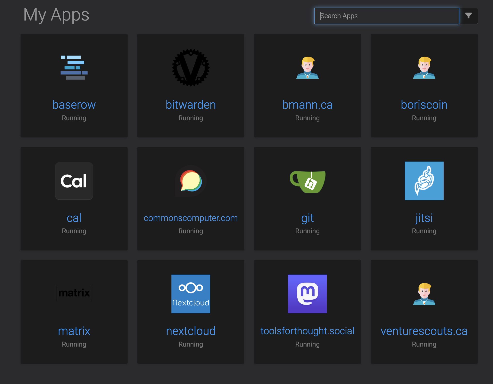

- Cleaned up [[Tools for Thought Rocks]] #Obsidian site some more https://notes.toolsforthought.rocks
	- Mainly converting from the old #LogSeq format -- I did add quite a few pages to the old site
- More [[Commons Computer]] #Cloudron setup
  collapsed:: true
	- Here's all the stuff I have running:
		- 
			-
	- I added [[Google/Calendar]] support to [[Cal.com]]
	  collapsed:: true
		- Google Cloud and OAuth apps are just... extremely complicated https://cal.com/docs/introduction/quick-start/self-hosting/install-apps/google
		- I can add up to 100 users in test mode, which seems like lots if anyone else wants to share a  Cal.com instance
		- I like that Cal.com can in fact setup weekly limits for bookings
		- My remaining wishlist item for this is to be able to select daily / weekly limits across all event types!
	- Installed [[Vaultwarden]] the Rust implementation of [[Bitwarden]]
	- I also added a #Jitsi server at https://jitsi.commonscomputer.com
	  collapsed:: true
		- These Jitsi servers are pretty basic, unclear how much load there actually is?
	- General observation: #Mastodon eats storage
	  collapsed:: true
		- Looking at storage usage on #Cloudron, [[Tools for Thought Rocks/Mastodon]] is at 8GB
			- This will be mostly cached media attachments
			- For reference, #CoSocial goes through 2TB of cached media attachments per month, with about 100 users
- [Principles for sharing on the Internet](https://sublimeinternet.substack.com/p/principles-for-sharing-on-the-internet), by [[Sari Azout]]
	- 1. Do the work required to have an opinion
	- 2. Allow yourself the uncomfortable luxury of changing your mind
	- 3. Cultivate intellectual humility
	- 4. Choose your words carefully
	- 5. Be kind, even if you are right
- One more [[Commons Computer]] #Cloudron install, [[n8n]]
-