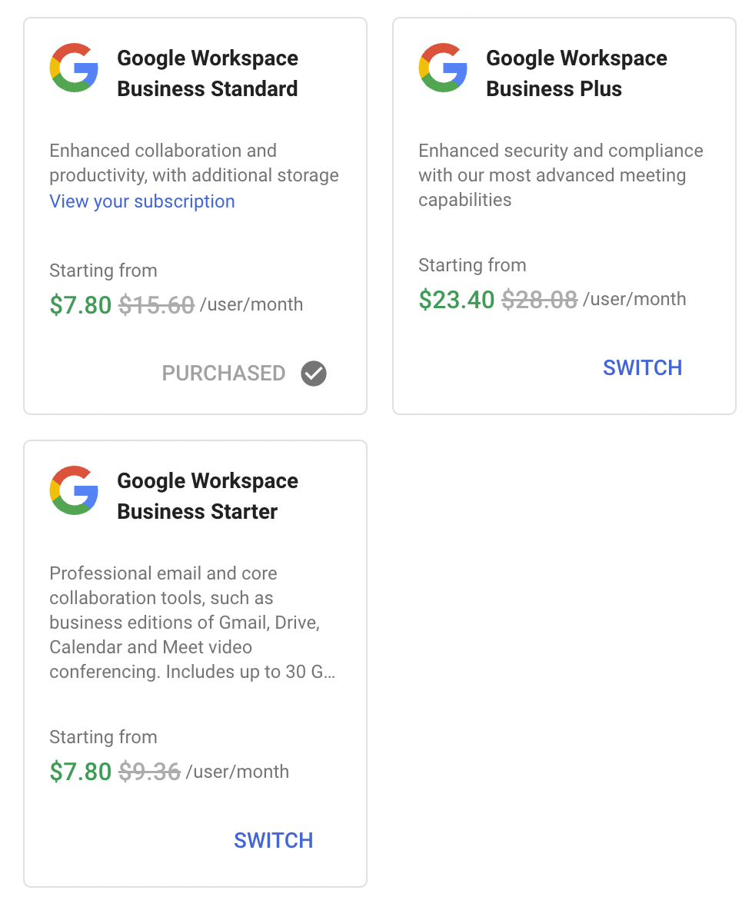
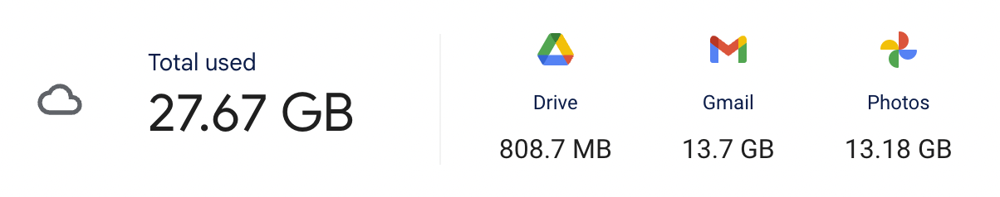

- I'm trying to consolidate various accounts and charges for digital things I pay for
	- Looking at Google Workspace aka Google Accounts, I have one paid for Google account
		- It's on Business Standard, which is $17.47CAD / month, including taxes
		- I don't know why it's showing this discount in the screenshot
			- 
		- The difference between Standard and Starter, is that Starter maxes out at 30GB of storage per user
		- Looking at how much storage I use, it's not much. The photos in there are legacy, I never seriously used Google Photos
			- 
			-
				-